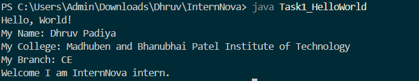
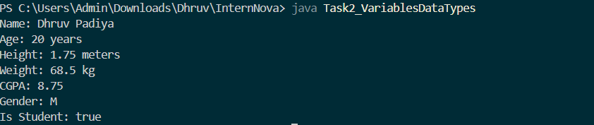
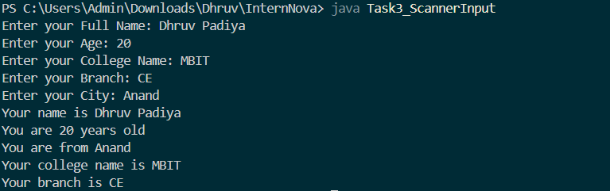
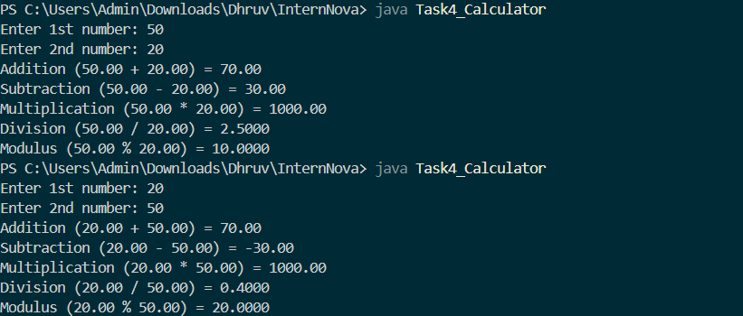
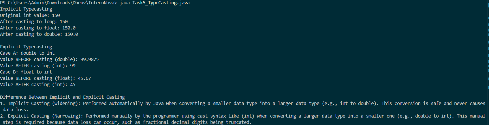
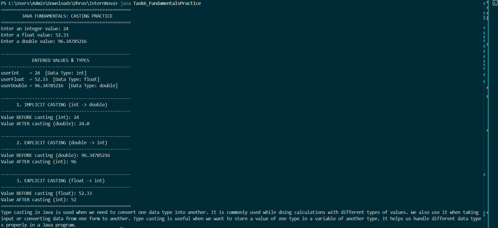

# Week 1: Java Fundamentals & Syntax

This directory contains the completed assignments and practical programming tasks for **Week 1** of the **InternNova** Java development internship. The tasks focus on core Java concepts, including program anatomy, primitive data types, user input handling with `Scanner`, arithmetic calculations, and implicit/explicit type casting.

---

## Overview

| Task | File Name | Key Concepts | Screenshot |
| :--- | :--- | :--- | :--- |
| **Task 1** | [`Task1_HelloWorld.java`](./Task1_HelloWorld.java) | Program entry point, console output, syntax basics | [Task_1.png](./Task_1.png) |
| **Task 2** | [`Task2_VariablesDataTypes.java`](./Task2_VariablesDataTypes.java) | Primitive types (`int`, `double`, `float`, `char`, `boolean`), Strings | [Task_2.png](./Task_2.png) |
| **Task 3** | [`Task3_ScannerInput.java`](./Task3_ScannerInput.java) | `java.util.Scanner`, standard input, newline buffer handling | [Task_3.png](./Task_3.png) |
| **Task 4** | [`Task4_Calculator.java`](./Task4_Calculator.java) | Arithmetic operations, formatting with `printf`, divide-by-zero check | [Task_4.png](./Task_4.png) |
| **Task 5** | [`Task5_TypeCasting.java`](./Task5_TypeCasting.java) | Widening (implicit) and Narrowing (explicit) conversion | [Task_5.png](./Task_5.png) |
| **Task 6** | [`Task6_FundamentalsPractice.java`](./Task6_FundamentalsPractice.java) | Comprehensive user input casting, precision analysis, recap | [Task_6.png](./Task_6.png) |

---

## Prerequisites

- **Java Development Kit (JDK)**: JDK 8 or higher (tested with OpenJDK 17)
- **Terminal / Command Prompt / PowerShell**

Check your local Java installation:

```bash
java -version
javac -version
```

---

## Tasks Breakdown

### Task 1: Hello World & Personal Introduction
- **File**: [`Task1_HelloWorld.java`](./Task1_HelloWorld.java)
- **Description**: Demonstrates basic Java program structure, standard entry method `public static void main(String[] args)`, and standard output using `System.out.println()`.
- **Compile & Run**:
  ```bash
  javac Task1_HelloWorld.java
  java Task1_HelloWorld
  ```
- **Output Preview**:
  

---

### Task 2: Variables & Data Types
- **File**: [`Task2_VariablesDataTypes.java`](./Task2_VariablesDataTypes.java)
- **Description**: Declares and initializes variables using multiple primitive data types (`int`, `double`, `float`, `char`, `boolean`) along with non-primitive `String`. Demonstrates clean formatted output.
- **Compile & Run**:
  ```bash
  javac Task2_VariablesDataTypes.java
  java Task2_VariablesDataTypes
  ```
- **Output Preview**:
  

---

### Task 3: Interactive User Input
- **File**: [`Task3_ScannerInput.java`](./Task3_ScannerInput.java)
- **Description**: Uses `java.util.Scanner` to capture various input types from `System.in` including strings, integers, and formatted results using `printf`.

> [!TIP]
> When reading numbers using `scanner.nextInt()` followed by `scanner.nextLine()`, remember to consume the lingering newline character to avoid skipping subsequent string inputs.

- **Compile & Run**:
  ```bash
  javac Task3_ScannerInput.java
  java Task3_ScannerInput
  ```
- **Output Preview**:
  

---

### Task 4: Arithmetic Calculator
- **File**: [`Task4_Calculator.java`](./Task4_Calculator.java)
- **Description**: Implements addition, subtraction, multiplication, division, and modulus operations on floating-point inputs. Includes validation logic to prevent runtime divide-by-zero errors.
- **Compile & Run**:
  ```bash
  javac Task4_Calculator.java
  java Task4_Calculator
  ```
- **Output Preview**:
  

---

### Task 5: Type Casting Demonstrations
- **File**: [`Task5_TypeCasting.java`](./Task5_TypeCasting.java)
- **Description**: Explores type conversions in Java:
  - **Implicit (Widening)**: Automatic safe conversion from smaller to larger data types (`int` &rarr; `long` &rarr; `float` &rarr; `double`).
  - **Explicit (Narrowing)**: Manual casting required when converting larger to smaller types (`double` &rarr; `int`, `float` &rarr; `int`), highlighting potential truncation or loss of precision.
- **Compile & Run**:
  ```bash
  javac Task5_TypeCasting.java
  java Task5_TypeCasting
  ```
- **Output Preview**:
  

---

### Task 6: Comprehensive Casting & Type Conversion Practice
- **File**: [`Task6_FundamentalsPractice.java`](./Task6_FundamentalsPractice.java)
- **Description**: Combines scanner inputs (`int`, `float`, `double`) with interactive widening and narrowing casting workflows, detailing before/after states and data integrity nuances.

> [!NOTE]
> Explicit casting truncates fractional parts rather than rounding them. For example, `99.9875` explicitly cast to `int` results in `99`.

- **Compile & Run**:
  ```bash
  javac Task6_FundamentalsPractice.java
  java Task6_FundamentalsPractice
  ```
- **Output Preview**:
  

---

## Directory Structure

```text
Week-1/
├── InternNova_Week-1.pdf           # Assignment instructions & documentation
├── README.md                       # Week 1 documentation and guide
├── Task1_HelloWorld.java           # Task 1 source file
├── Task2_VariablesDataTypes.java   # Task 2 source file
├── Task3_ScannerInput.java         # Task 3 source file
├── Task4_Calculator.java           # Task 4 source file
├── Task5_TypeCasting.java          # Task 5 source file
├── Task6_FundamentalsPractice.java # Task 6 source file
└── Task_*.png                      # Output verification screenshots (Task 1 - 6)
```

---

## Running All Tasks

To compile and test all tasks in this directory sequentially:

```bash
# Compile all source files
javac *.java

# Execute individual tasks
java Task1_HelloWorld
java Task2_VariablesDataTypes
java Task3_ScannerInput
java Task4_Calculator
java Task5_TypeCasting
java Task6_FundamentalsPractice
```
